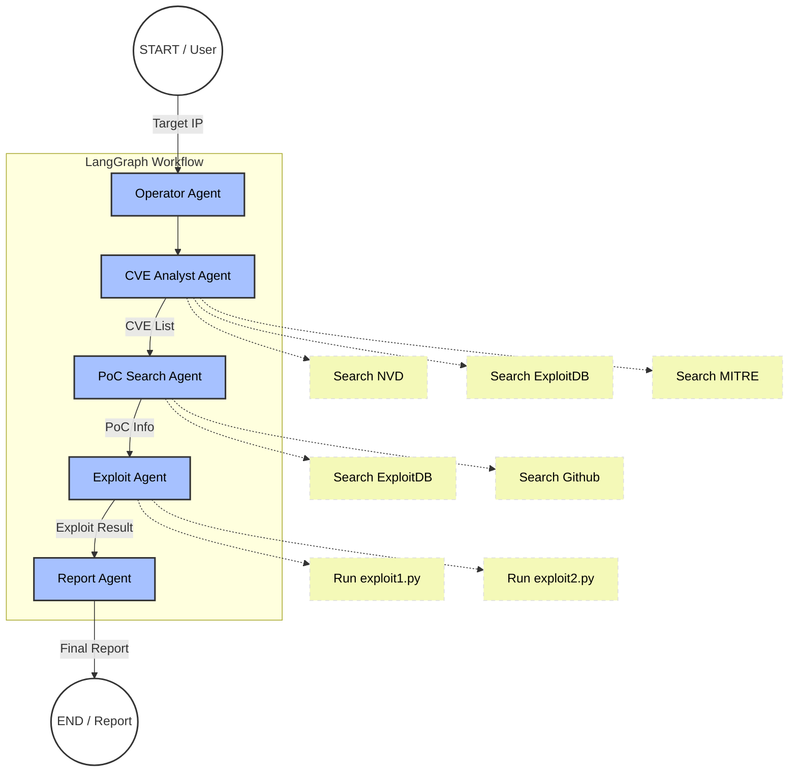

# AI_redteam

# Role
You are an expert Python developer specializing in LangChain and LangGraph.

# Task
I want to implement a multi-agent security assessment workflow based on the following architecture using **LangGraph**.
Please generate a modular Python project structure suitable for VS Code.

# Architecture Overview

1.  **Shared State (`AgentState`):**
    -   `target_ip` (str)
    -   `cve_list` (List[str])
    -   `poc_info` (List[str])
    -   `exploit_results` (str)
    -   `final_report` (str)
    -   `messages` (List[BaseMessage])

2.  **Agents (Nodes):**
    -   `Operator`: Entry point. Initializes the workflow with the target IP.
    -   `CVE Analyst`: Uses tools (mock) to search NVD/MITRE for the target IP and updates `cve_list`.
    -   `PoC Search`: Searches ExploitDB/Github (mock) for the found CVEs and updates `poc_info`.
    -   `Exploit Agent`: Executes exploit scripts (mock) based on PoC info and updates `exploit_results`.
    -   `Report Agent`: Aggregates all info into a final report string.

3.  **Workflow (Graph Edges):**
    Operator -> CVE Analyst -> PoC Search -> Exploit Agent -> Report Agent -> END

# Requirements
-   **File Structure:** Please propose a clean directory structure (e.g., `main.py`, `state.py`, `agents/`, `tools/`).
-   **LangGraph Implementation:** Use `StateGraph` to connect the nodes.
-   **Tools:** Create dummy/mock functions for the tools (e.g., `search_nvd`, `run_exploit`) using the `@tool` decorator.
-   **Environment:** Use `python-dotenv` to load API keys.
-   **Code:** Provide the full code for `main.py`, `state.py`, and examples for the agents and tools.

Please start by showing the file structure, then provide the code for each file.
